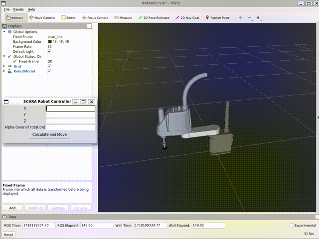

# SCARA-robot-modeling-Ctrl
This is a simple robot kinematics process project, including pose control, trajectory control and quintic polynomial continuous trajectory, written in python


# How to use
after you download this files and put it in your workspace/src in ubuntu, open terminal in your workspace
```
catkin_make
source ./devel/setup.bash
```
This will compile all the files and source it. Run the following code to start this
```
roslaunch SCARA display.launch
```
add robot model from left botton "Add" and change fixed frame to base_link

you can just open control GUI with following command in "your workspace/src/SCARA/SCARA_Ctrl"

```
python3 move_GUI_xd.py
```

a project for controlling SCARA with Rviz&amp;ROS&amp;Python
