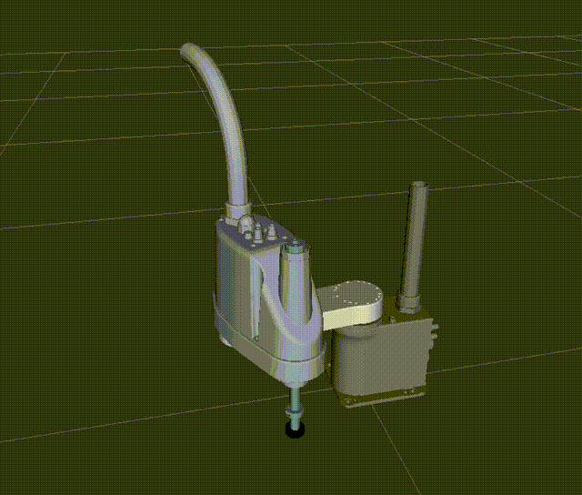
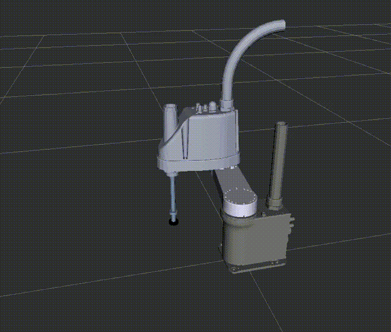

# SCARA-robot-modeling-Ctrl
This is a simple robot kinematics process project, including pose control, trajectory control and quintic polynomial continuous trajectory, written in python
# Before you go

this project rely on python scripts, before you go, you should run the following command in your workspace/src/SCARA
```
pip3 install -r requirements.txt
```

# How to use
After you download this files and put it in your workspace/src in ubuntu, open terminal in your workspace
```
catkin_make
source ./devel/setup.bash
```
This will compile all the files and source it. Run the following code to start this
```
roslaunch SCARA display.launch
```
Add robot model from left botton "Add" and change fixed frame to base_link

You can just open control GUI with following command in "your workspace/src/SCARA/SCARA_Ctrl"

```
python3 move_GUI_xd.py
```
The GUI can be seen like this, you can input any pose if only within its workspace


You can also make it run on a trajectory of multiple straight lines

```
python3 move_trace1.py
```
It's a simple presentation of trajectory, you can also edit the trajectory by changing the points in move_trace1.py



Similarly, if you want the trajectory to be flexible (velocity and acceleration changing continuously), I also write a fifth degree polynomial to make it run more realistically

```
python3 move_trace_soft.py
```
more realistic and less harm to the motors, you can also edit the trajectory by changing the points in move_trace_soft.py



# Notes:
- this script is still editting
- The principle of the script is to find feasible joint values through the inverse kinematics algorithm, and finally run it in rviz combined with ros. It is being optimized, and suggestions can be posted.

a project for controlling SCARA with Rviz&amp;ROS&amp;Python
